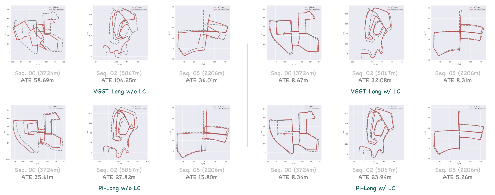

<p align="center">
<p align="center">
<h1 align="center">Pi-Long: Extending $\pi^3$'s Capabilities on Kilometer-scale with the  Framework of VGGT-Long</h1>
</p>

We received some feedback suggesting that `VGGT-Long`, as a lightweight extension method, can be easily migrated to other methods, such as `Pi3`. We found this to be an excellent idea, and as an extension method, compatibility with similar methods should indeed be one of its key features. The `Pi-Long` project is built on this background. The goals of this project are:

1. To provide a practical example of migrating `VGGT-Long` to other similar methods like `Pi3`;
2. `Pi3` is superior to `VGGT` in reconstruction stability, and `Pi-Long` is based on this to explore its performance of `Pi3` at the kilometer scale;
3. To provide a new baseline to facilitate future research
4. To provide a better method for the community to use;

Thanks to the modular code design of `VGGT-Long` and `Pi3`, the development of `Pi-Long` was straightforward. We have conducted some experiments as shown in the figure below.



As can be seen from the experiments, `Pi-Long`, implemented based on `Pi3`, exhibits more stable tracking performance in long-sequence outdoor scenarios. Particularly, without relying on the LC module, the performance of `Pi-Long` is significantly higher than that of `VGGT-Long`.

`Pi-Long` **is not accompanied by a dedicated paper**. This repository is built on the [VGGT-Long](https://github.com/DengKaiCQ/VGGT-Long) and [Pi3](https://github.com/yyfz/Pi3). So if you need the technical details of `Pi-Long`, please refer to the following two papers:

[VGGT-Long: Chunk it, Loop it, Align it -- Pushing VGGT's Limits on Kilometer-scale Long RGB Sequences](https://arxiv.org/abs/2507.16443)

[$\pi^3$: Scalable Permutation-Equivariant Visual Geometry Learning](https://arxiv.org/abs/2507.13347)


### **Changelog**

`[04 Sep 2025]` Code of `Pi-Long` release.

##  Setup, Installation & Running

### 🖥️ 1 - Hardware and System Environment 

This project was developed, tested, and run in the following hardware/system environment

```
Hardware Environment：
    CPU(s): Intel Xeon(R) Gold 6128 CPU @ 3.40GHz × 12
    GPU(s): NVIDIA RTX 4090 (24 GiB VRAM)
    RAM: 67.1 GiB (DDR4, 2666 MT/s)
    Disk: Dell 8TB 7200RPM HDD (SATA, Seq. Read 220 MiB/s)

System Environment：
    Linux System: Ubuntu 22.04.3 LTS
    CUDA Version: 11.8
    cuDNN Version: 9.1.0
    NVIDIA Drivers: 555.42.06
    Conda version: 23.9.0 (Miniconda)
```

### 📦 2 - Environment Setup 

**Note:** This repository contains a significant amount of `C++` code, but our goal is to make it as out-of-the-box usable as possible for researchers, as many deep learning researchers may not be familiar with `C++` compilation. Currently, the code for `Pi-Long` can run in a **pure Python environment**, which means you can skip all the `C++` compilation steps in the `README`.

#### Step 1: Dependency Installation

Creating a virtual environment using conda (or miniconda),

```cmd
conda create -n pi-long python=3.10
conda activate pi-long
# pip version created by conda: 25.1
```

Next, install `PyTorch`,

```cmd
pip install torch==2.5.1 torchvision==0.20.1 torchaudio==2.5.1 --index-url https://download.pytorch.org/whl/cu118

# torch 2.2.0 is not working for Pi3
# please use the newer version of torch
# verified to work with torch 2.5.1
```

Install other requirements,

```cmd
pip install -r requirements.txt
```

#### Step 2: Weights Download

Download all the pre-trained weights needed:

```cmd
bash ./scripts/download_weights.sh
```

You can skip the next two steps if you would like to run `Pi-Long` in pure `Python`.

#### Step 3 (Optional) : Compile Loop-Closure Correction Module

Same as `VGGT-Long`, we provide a Python-based Sim3 solver, so `Pi-Long` can run the loop closure correction solving without compiling `C++` code. However, we still recommend installing the `C++` solver as it is more **stable and faster**.

```cmd
python setup.py install
```

#### Step 4 (Optional) : Compile `DBoW` Loop-Closure Detection Module

The VPR Model of `DBoW` is for performing VPR Model inference with CPU-only. You can skip this step.

<details>
  <summary><strong>See details</a></strong></summary>

Install the `OpenCV C++ API`.


```cmd
sudo apt-get install -y libopencv-dev
```

Install `DBoW2`

```cmd
cd DBoW2
mkdir -p build && cd build
cmake ..
make
sudo make install
cd ../..
```

Install the image retrieval

```cmd
pip install ./DPRetrieval
```

</details>

### 🚀 3 - Running the code


```cmd
python pi_long.py --image_dir ./path_of_images
```

or

```cmd
python pi_long.py --image_dir ./path_of_images --config ./configs/base_config.yaml
```

## Acknowledgements

Our project is based on [VGGT](https://github.com/facebookresearch/vggt), [VGGT-Long](https://github.com/DengKaiCQ/VGGT-Long) and [Pi3](https://github.com/yyfz/Pi3). Our work would not have been possible without these excellent repositories.

## Citation

If you use this repository in your academic project, please cite both of the two related works below:

```
@misc{deng2025vggtlongchunkitloop,
      title={VGGT-Long: Chunk it, Loop it, Align it -- Pushing VGGT's Limits on Kilometer-scale Long RGB Sequences}, 
      author={Kai Deng and Zexin Ti and Jiawei Xu and Jian Yang and Jin Xie},
      year={2025},
      eprint={2507.16443},
      archivePrefix={arXiv},
      primaryClass={cs.CV},
      url={https://arxiv.org/abs/2507.16443}, 
}
```

```
@misc{wang2025pi3,
      title={$\pi^3$: Scalable Permutation-Equivariant Visual Geometry Learning}, 
      author={Yifan Wang and Jianjun Zhou and Haoyi Zhu and Wenzheng Chang and Yang Zhou and Zizun Li and Junyi Chen and Jiangmiao Pang and Chunhua Shen and Tong He},
      year={2025},
      eprint={2507.13347},
      archivePrefix={arXiv},
      primaryClass={cs.CV},
      url={https://arxiv.org/abs/2507.13347}, 
}
```

## License

Both [VGGT-Long](https://github.com/DengKaiCQ/VGGT-Long) and [Pi3](https://github.com/yyfz/Pi3) are developed based on [VGGT](https://github.com/facebookresearch/vggt). Therefore the `Pi-Long` codebase follows `VGGT`'s license, please refer to `./LICENSE.txt` for applicable terms.
